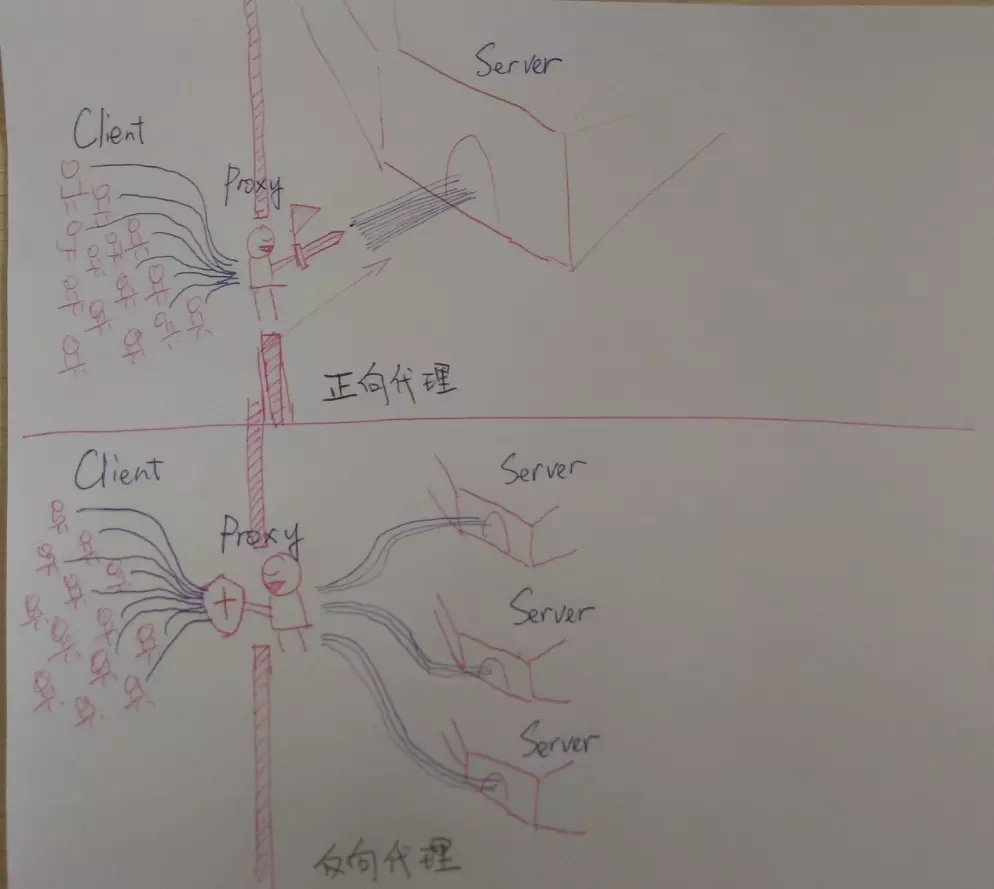

## 正向代理与反向代理

---

### 一、 区别

> *当代理服务器受你控制时，即为正向代理；反之即为反向代理*

> 引用自知乎的两张图片。




### 二、代理在ngixn中的应用

- 正向代理
由于nginx本身不支持正想代理，所以需要安装一个第三方模块
[安装地址](https://github.com/chobits/ngx_http_proxy_connect_module#install)

```nginx
server {
  listen                         8818;

  # dns resolver used by forward proxying
  resolver                       8.8.8.8;
  # forward proxy for CONNECT request
  proxy_connect;
  proxy_connect_allow            443 563;
  proxy_connect_connect_timeout  60s;
  proxy_connect_read_timeout     60s;
  proxy_connect_send_timeout     60s;
  access_log  logs/forward_proxy_access.log;
  # forward proxy for non-CONNECT request
  location / {
      #proxy_pass http://$host;
      proxy_pass $scheme://$http_host$request_uri;
      proxy_set_header Host $host;
  }
}
```

- 反向代理

```nginx
location /api {
    proxy_pass http://127.0.0.1/web;
}
```
